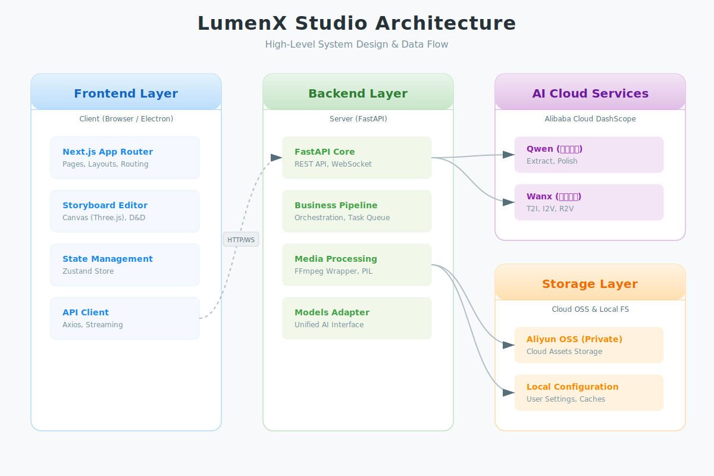

<!-- Banner Placeholder -->
<div align="center">
  
</div>

<div align="center">

# LumenX Studio

### AI 原生短漫剧创作平台
**Render Noise into Narrative**

[](LICENSE)
[](https://www.python.org/)
[](https://nodejs.org/)
[](https://github.com/alibaba/lumenx)

[English](README_EN.md) | [中文](README.md) | [用户手册](USER_MANUAL.md) | [贡献指南](CONTRIBUTING.md)

</div>

---

LumenX Studio 是一个**AI 短漫剧一站式生产平台**。它能够将小说文本转化为动态视频，打通了从剧本分析、角色定制、分镜绘制到视频合成的完整创作链路。

LumenX Studio将 **资产提取—>风格定调—>资产生成—>分镜脚本构造->分镜图生成—>分镜视频生成** 的全链路SOP天然与该平台功能集成，在提供完善功能的基础上融入短漫剧行业Know-How，方便大家快速制作出质量过关的AI短片，大大提升生产效率。

本平台天然集成 阿里的Qwen & Wanx 系列模型能力，致力于提供智能便捷、灵活可控的漫剧制作体验，无需频繁切换网页或App，使创作者能够一站式地完成短漫剧制作。

---

## ✨ 核心亮点

| 能力 | 描述 |
|------|------|
| 📝 **深度剧本分析** | 基于 LLM 自动提取角色、场景、道具，生成专业分镜脚本 |
| 🎨 **可控美术指导** | 支持自定义视觉风格，保持全片画风统一 |
| 🎬 **可视化分镜** | 拖拽式分镜编辑器，所见即所得地组合人物、背景与特效 |
| 🎥 **多模态生成** | 集成通义万相 (Wanx) 等模型，支持文生图、图生视频 |
| 🎵 **智能视听合成** | 自动生成角色配音 (TTS)、音效 (SFX) 并合成最终视频 |

---

## 📸 产品演示

<div align="center">
  <!-- 待补充演示 GIF -->
  
</div>

---

## 🏗️ 系统架构

LumenX Studio 采用前后端分离的现代化架构，确保了扩展性与性能。

<div align="center">
  <!-- 架构图 -->
  
</div>

**技术栈：**
- **Frontend**: Next.js 14 + React 18 + TypeScript + Tailwind CSS
- **Backend**: FastAPI + Python 3.11+
- **AI Core**: Alibaba Cloud Qwen (Logic) + Wanx (Visuals)
- **Render**: Three.js (Canvas) + FFmpeg (Video Processing)

---

## 🚀 快速开始

### 1. 环境准备

- **Python**: 3.11+
- **Node.js**: 18+
- **FFmpeg**: 必须安装 (用于视频处理)

### 2. 克隆项目

```bash
git clone https://github.com/alibaba/lumenx.git
cd lumenx
```

### 3. 配置密钥

复制配置文件并填入 API Key（需开通阿里云百炼服务）：

```bash
cp .env.example .env
# 编辑 .env 文件，填入 DASHSCOPE_API_KEY
```

### 4. 启动后端

```bash
# 安装依赖
pip install -r requirements.txt

# 创建输出目录
mkdir -p output/uploads

# 启动服务 (http://localhost:8000)
./start_backend.sh
```

### 5. 启动前端

```bash
cd frontend

# 安装依赖 & 启动服务 (http://localhost:3000)
npm install && npm run dev
```

---

## 📖 文档中心

- **[用户手册](USER_MANUAL.md)**: 必读！详细的功能使用说明。
- **[API 文档](http://localhost:8000/docs)**: 后端接口定义的 Swagger UI。

---

## ⚙️ 进阶配置

<details>
<summary>点击展开详细配置说明</summary>

### OSS 对象存储（推荐）
为了安全和性能，建议配置阿里云 OSS 存储生成的媒体文件：

1. 创建 **私有 (Private)** Bucket
2. 在 `.env` 或应用设置中配置：
   ```env
   ALIBABA_CLOUD_ACCESS_KEY_ID=...
   ALIBABA_CLOUD_ACCESS_KEY_SECRET=...
   # 在应用内配置 Bucket 名称和 Endpoint
   ```

### 配置文件路径
- **开发模式**: 项目根目录 `.env`
- **打包应用**: 用户主目录 `~/.lumen-x/config.json`

</details>

---

## 📁 目录结构

```
lumenx/
├── frontend/          # Next.js 前端工程
├── src/               # Python 后端核心
│   ├── apps/         # 业务逻辑
│   ├── models/       # AI 模型接口
│   └── utils/        # 工具库
├── output/            # (自动生成) 项目输出目录
```

---

## 🤝 参与贡献

我们非常欢迎社区贡献！请先阅读 [贡献指南](CONTRIBUTING.md) 了解代码规范和提交流程。

- **Bug 反馈**: 请提交 [GitHub Issues](https://github.com/alibaba/lumenx/issues)
- **功能建议**: 欢迎在 [Discussions](https://github.com/alibaba/lumenx/discussions) 中讨论

## 👤 作者与联系方式

本项目由 **星莲 (StarLotus)** 主导开发与维护。

如果您在使用过程中遇到问题，或有任何建议，欢迎通过以下方式联系：

- **反馈与交流**: [GitHub Issues](https://github.com/alibaba/lumenx/issues)
- **技术讨论**: [GitHub Discussions](https://github.com/alibaba/lumenx/discussions)
- **邮件联系**: [zhangjunhe.zjh@alibaba-inc.com](mailto:zhangjunhe.zjh@alibaba-inc.com)

---

## 📄 许可证

本项目基于 [MIT License](LICENSE) 开源。

---

<div align="center">
  Made with ❤️ by Alibaba Group
</div>

